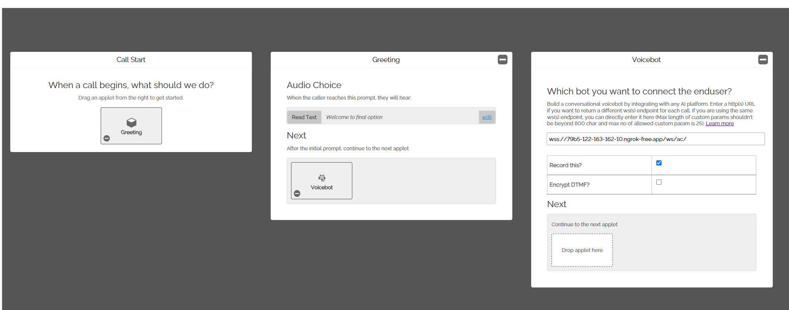
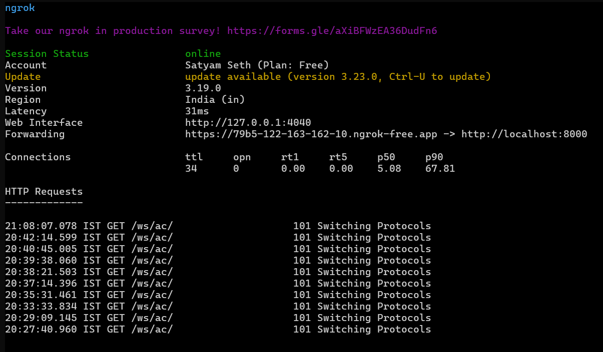
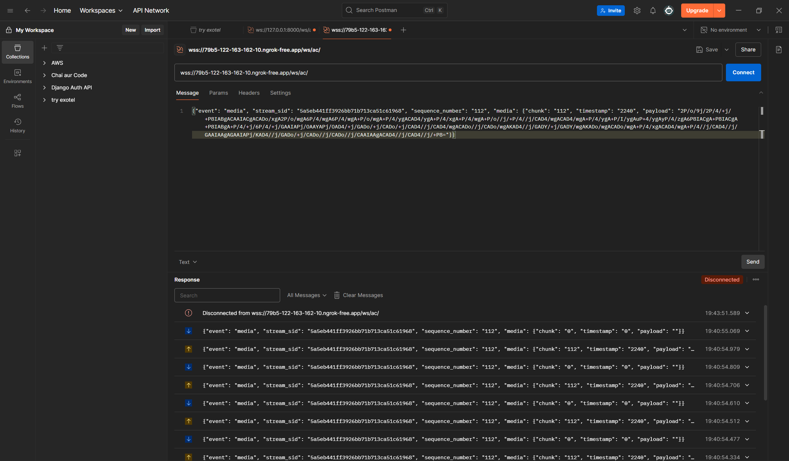

# Exotel Voice Setup

- Create a Exotel App [Manage -> App Bazaar]

- Assign a phone number to the app [Manage -> Exo Phones]

- Check call recording and call logs [Calls -> Inbox]

- Voice Applets setup video [Link](https://www.loom.com/share/ae049b2f8c654c3cb983fbfaf58dadbe)

- Working with the Stream and Voicebot Applet [Doc](https://support.exotel.com/support/solutions/articles/3000108630-working-with-the-stream-applet)

    - [PDF Doc](./voicebot.pdf)

- Voice Bot FAQ [Link](https://support.exotel.com/support/solutions/articles/3000112112-voice-bot)



# How to run the code

- Create a virtual environment

    ```sh
    python3 -m venv .venv
    ```

- Activate the virtual environment

    ```sh
    source .venv/bin/activate
    ```

- Install the required packages

    ```sh
    pip install -r requirements.txt
    ```

- Run server

    ```sh
    python manage.py runserver
    ```

- Start [ngrok](https://ngrok.com/downloads/)

    ```sh
    ngrok http 8000
    ```

- Use ngrok URL in Exotel Applet configuration

- 

- Note: we have to open ngrok url in browser for first time and click the verify button.

- Now call to your exotel number and it will connect to the voice applet.

- Sample server [logs](./sample.log)

# Bonus

- Voice Streaming Sample Repo [Link](https://github.com/exotel/voice-streaming/tree/main)

- We can use [PyAudio](https://pypi.org/project/PyAudio/) library for audio operations.

- We can use postman to test our websocket endpoint

  

# Pending 

- Send media chunks back to exotel

- Create an audio file received chunks from exotel
